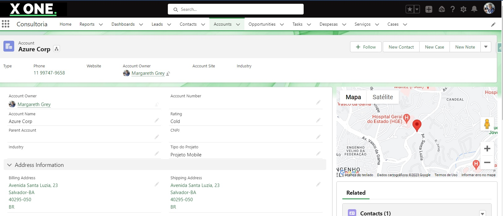

# map-location
The idea was to create a geolocation system for company accounts. In this way, the team can better direct its campaign according to the incidence of accounts in each region.
  

  

 

The map is updated in real time when the user adds or changes the address in the system.
The visualization can be Zoomed out and Zoomed in, as well as changing from map to satellite according to the user's preference.
 

  

 
 
<a href="https://drive.google.com/file/d/1oEtAu-HORqyTiUOmuYF70qNVe-QZ-BsX/view?usp=share_link">Video Demo here</a> 
